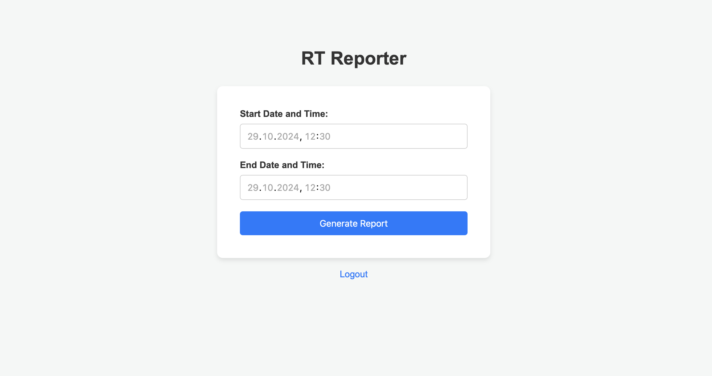

<h1 align="center">RT-Reporter</h1>

## About The Project
<br />
<div align="center">
  <a href="">
    
  </a>
</div>
RT-Reporter is a tool dedicated to creating reports in PDF format for the Request Tracker tool - a tool dedicated to handling tickets, in the case of SOC/CERT teams to respond to security incidents. The RT-Reporter tool is built based on Flask and HTML and CSS. The version presented in this repository creates a simple summary of handled incidents in the time period declared by the user.
Here's why:
* Your time should be focused on creating something amazing. A project that solves a problem and helps others
* You shouldn't be doing the same tasks over and over like creating a README from scratch
* You should implement DRY principles to the rest of your life :smile:

Of course, no one template will serve all projects since your needs may be different. So I'll be adding more in the near future. You may also suggest changes by forking this repo and creating a pull request or opening an issue. Thanks to all the people have contributed to expanding this template!


## Getting Started
Below I'll give you information on how to properly run the tool on your Request Tracker instance.

### Prerequisites
The tool works on the basis of the mysql database, the database dedicated to Request Tracker, i.e. rt5. For security reasons, the tool works on the basis of the privileges of a low-level mysql user, which you must create and grant privileges to. You can do this in a simple way:

* mysql login
  ```sh
  mysql -u root -p
  ```
* mysql user creation
  ```sh
  CREATE USER 'reporter'@'localhost' IDENTIFIED BY 'password';
  ```
* Granting permissions
  ```sh
  GRANT SELECT on rt5.Tickets TO 'reporter'@'localhost' WITH GRANT OPTION  
  ```

### Installation

First, clone this repository, then install the modules from the requirements.txt file. Finally, run the application.

1. Clone the repo
   ```sh
   git clone https://github.com/mikolajdreger/RT-Reporter.git
   ```
3. Install requirements.txt
   ```sh
   pip3 install -r requirements.txt
   ```
4. Run the application. 
   Test env:

   ```sh
   python3 app.py
   ```
   Prod env:
   ```sh
  apt install gunicorn -y
  gunicorn -w 4 --bind 0.0.0.0:8080 app:app 
  ```
